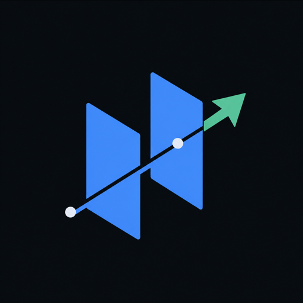

<p align="center">
  
</p>

<h1 align="center">Vecgra</h1>

<p align="center">
  <strong>One graph. One vector space. One file.</strong><br>
  Nodes, relationships, properties, and multivectors in a fast embedded Rust database.
</p>

<p align="center">
  <a href="https://github.com/r-firth/vecgra/actions/workflows/ci.yml"></a>
  <a href="LICENSE"></a>
  
</p>

<p align="center">
  <a href="#quick-start">Quick start</a> ·
  <a href="#what-this-unlocks">Ideas</a> ·
  <a href="docs/studio.md">Studio</a> ·
  <a href="docs/architecture.md">Architecture</a> ·
  <a href="docs/benchmarks.md">Benchmarks</a> ·
  <a href="CONTRIBUTING.md">Contribute</a>
</p>

<!-- Demo video: paste the GitHub attachment directly above this comment. -->

Vecgra is a vector-native embedded graph database. It stores a labelled
property multigraph, node and relationship embeddings, and multivectors in one
portable `.vg` file.

Most graph databases bolt a vector index onto nodes. Vecgra makes vectors
part of the graph itself: relationships are searchable elements, graph
predicates can shrink the candidate set before scoring, and a semantic query
can return a path—not merely a pile of nearby chunks.

> [!IMPORTANT]
> Vecgra is an early 0.1 source release. It does not yet promise production
> support or a stable on-disk/API contract.

The headless engine and CLI are the portable core and are checked on Linux and
macOS. Studio is currently verified on Apple Silicon macOS; Windows and Linux
remain source targets until native launch evidence exists. See the
[release checklist](docs/release-checklist.md) for the exact publication bar.

## What this unlocks

- **Ask why, not just what.** Search for “why did authentication move to the
  gateway?” and rank the discussion, decision, commit, and `CHANGES` /
  `CLOSES` relationships as one evidence path.

- **Search relationships directly.** Find every edge that *means* “blocks,”
  “supports,” or “contradicts,” even when its endpoints and source schemas are
  unrelated. Embedded edges become a practical semantic ontology layer.

- **Move between modalities.** Start with a screenshot embedding, land on the
  matching UI component, then traverse to its owner, source files, pull
  requests, releases, and incidents. Text, image, and audio facets can share a
  space without changing the graph model.

- **Build small, inspectable context packets.** Use semantic search to enter a
  large knowledge graph, then expand only bounded, connected evidence around
  the best matches. An agent receives provenance and structure instead of an
  unconnected top-k chunk list.

- **Run semantic blast-radius analysis.** Describe a behaviour rather than a
  symbol name, find the relevant nodes and edges, then traverse dependencies,
  deployments, ownership, or compatibility constraints before making a
  recommendation.

These are ordinary graph workloads composed with native vector operators—not
agent-framework concepts baked into the storage model.

## Built differently

- **Vectors belong to graph elements.** Nodes and parallel/self relationships
  can each own one or more vectors.
- **Hybrid work happens in one engine.** Typed predicates, compressed candidate
  sets, bounded traversal, exact scoring, and approximate reranking share an
  execution path.
- **Multivectors are first-class.** Weighted late interaction lets independent
  facets or modalities find their best match before producing one element
  score.
- **The file is the database.** Append-only transactions recover from torn
  tails; columnar checkpoints, mapped vectors, CSR adjacency, and typed postings
  live together.
- **Memory is explicit.** F16 is the mapped compute source by default; hot F32
  promotion is opt-in and reports its allocation.
- **Plans are inspectable.** Scalar and vector paths expose their filters,
  candidate budgets, strategy, and rerank work as structured diagnostics.

The native Rust API is the primary surface. The CLI also includes a focused
one-hop Cypher-compatible query subset and hybrid semantic-pattern operators.

## Quick start

Build the engine and CLI:

```sh
cargo build --release
```

The repository pins Rust 1.97.1 and installs `rustfmt` and Clippy through
`rust-toolchain.toml`.

Run the native API quickstart to create a database, embed nodes and a
relationship, search both, and traverse the result:

```sh
cargo run -p vecgra --example quickstart
```

The complete, small Rust program is in
[`crates/vecgra/examples/quickstart.rs`](crates/vecgra/examples/quickstart.rs).

Create a real engineering-history graph from GitHub, using the deterministic
offline embedder for a quick local run. Authentication comes from
`GITHUB_TOKEN`, `GH_TOKEN`, or an existing `gh auth login` session.

```sh
target/release/vecgra import-github \
  BurntSushi/ripgrep ripgrep.vg

target/release/vecgra stats ripgrep.vg
target/release/vecgra check ripgrep.vg
cargo run --release -p vecgra-studio -- ripgrep.vg
```

The hash embedder tests storage and interaction; it is not a semantic model.
For semantic quality, build with Qwen3-Embedding-8B through OpenRouter and use
the same database-level model for queries:

```sh
export OPENROUTER_API_KEY=...
export VECGRA_EMBEDDER=qwen

target/release/vecgra import-github \
  BurntSushi/ripgrep ripgrep-qwen.vg

target/release/vecgra semantic-text \
  ripgrep-qwen.vg "why was this behaviour changed"

cargo run --release -p vecgra-studio -- ripgrep-qwen.vg
```

Generic JSONL, fbin plus typed metadata, Graphalytics, and Rust/Tree-sitter
imports are also available. See the CLI help and the
[GitHub importer schema](docs/github-import.md).

## Vecgra Studio

Studio opens the same `.vg` file directly in read-only mode. It is a native
GPUI application with GPU-painted graphs, animated structural and force
layouts, semantic level of detail, deep zoom, node manipulation, relationship
inspection, and text/semantic/hybrid search over both nodes and edges.
Its dense, material-aware application chrome is built with
[Bezel](https://github.com/crabtalk/bezel), while the graph remains a dedicated
GPU-painted canvas.

Press `Cmd-K` to search. Selecting a result animates into its connected
context; double-clicking a node opens a relationship-diverse two-hop focus and
keeps the overview available as an exact animated return.

Read the [Studio interaction and architecture notes](docs/studio.md).

## Benchmarks

Representative warm results from the same Apple Silicon development machine:

| Workload | Result | Quality |
| --- | ---: | ---: |
| VIBE/Yandex, 1M × 200-D | 5.42 ms p50 | 0.9967 official recall@10 |
| MoReVec, 99,560 × 768-D, filtered | 2.06 ms p50 total | 0.9992 official recall@10 |
| Graphalytics wiki-Talk, 2.39M vertices / 5.02M edges | 69.2 ms BFS p50 | all reference distances agree |

In the local Neo4j Enterprise 2026.07 audit, Vecgra was about 3.5× faster
at slightly higher recall on the million-vector workload, 4.8–26× faster on
native filtered search, and 1.26× faster on BFS than four-thread GDS. Its
vector-bearing files were 3.3–3.4× smaller; Neo4j's pure graph store was 28%
smaller.

Those are development-machine measurements, not universal claims. Corpus
details, exact configurations, recall methodology, memory policy, and caveats
are in [the reproducible benchmark notes](docs/benchmarks.md). A latency number
without recall is not accepted as an optimization.

## Read deeper

- [Storage and execution architecture](docs/architecture.md)
- [Benchmark methodology and competitor audits](docs/benchmarks.md)
- [GitHub engineering-graph schema](docs/github-import.md)
- [Studio architecture and interaction contract](docs/studio.md)
- [Research and frontier design notes](docs/research.md)
- [Dependency and licence policy](docs/dependencies.md)
- [Release checklist](docs/release-checklist.md)

Vecgra is general-purpose graph infrastructure. Agent context is a strong
workload because it benefits from semantic entry points and evidence paths;
the database itself contains no agent-only TTL, ACL, or framework concepts.

## Licence

Vecgra is licensed under [Apache License 2.0](LICENSE). Narrow third-party
compatibility sources retain the licences documented in
[`third-party/`](third-party/README.md).
